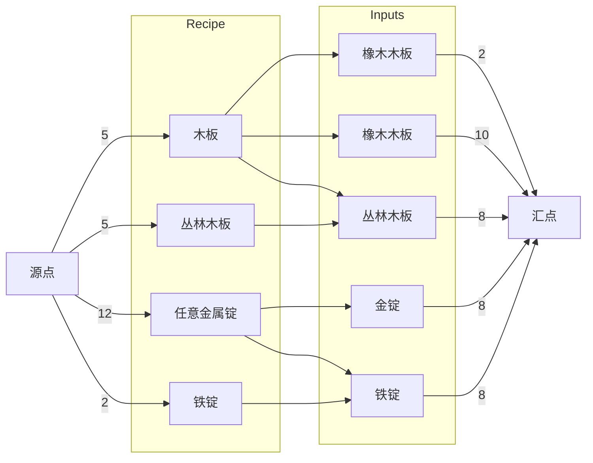

# polymer-machine
新一代自定义机器 mod

## 实现目标
一阶段主要目标为实现自定义单方块机械，但是需要为后面对接`Polymer Core` 实现多方快机械定义提供预留设计接口，`GUI`部分自定义代码尽可能独立于其他代码以便日后将其独立为`Polymer GUI`模块。   
早期版本将使用 `kotlin script` 加载, 后期将向 `zen code` 和 `javascript` 语法扩展

## TODOs
- [ ] 自定义机器合成表，使用一套通用的合成表语法
- [ ] 自定义机器处理流程，通过命令的简单组合实现对输入合成表的不同解析方案
- [ ] 自定义机器`update`方法，针对某些难以抽象的机器逻辑允许自定义`update`方法进行更复杂的操作
- [ ] 自适应数据存储和网络同步，抽象机器的状态存储并且自动对其进行序列化和网络同步
- [ ] 根据机器的组件来创建机器的方块，尽量兼容更多不同种类的io
- [ ] 类响应式的状态数据，为后面GUI和动画做准备
- [ ] 自定义机器GUI和JEI
- [ ] 自定义机器模型动画效果

## 语法定义

- 机器输入组件分为三种类别`材料(Ingredient)`、`标量(Scalar)`、和`条件(Condition)`
> 将所有输入类别统一处理不仅麻烦而且性能并不好，同时判定的方式也不一样。例如，物品的输入可以是任意类型，那么使用二分图之类的匹配方式性能会更好但是这种匹配则不适用于能量类的输入，所以，物品、流体类的输入为`材料`，能量，魔力类输入为`标量`，环境类输入为`条件`   
- 机器处理流程定义使用一连串的`指令(Instruction)`进行标记，一串指令的集合作为一条`流水线(Pipeline)`，多条流水线同步处理，一条流水线中的指令按顺序执行   
  除了流水线之外，机器还能处理方块的其他事件，包括`update`方法，传入一个抽象的`MachineContext`进行操作   
  机器组件区分为 `储存(Storage)` 和 `组件(Component)`, 系统机器内的数据存储使用类似响应式的设计方案   
  机器 GUI 定义另行设计
- 合成表独立定义，视情况考虑使用`Map`或者索性直接脚本的自定义类，通过给定的`Key`来指定输入输出，同时可以添加自定义的参数
- 指令定义方式为`lambda`表达式, 指令分为四种类别：`单步指令`、`持续指令`、`条件指令`和`复合指令`

### 机器定义脚本示例

```kotlin
val electricFurnance = buildMacine {
    id = "test_machine"
    displayName = "测试"
    
    val progress = ref("currentTicks", 0.0)
    val status = ref("status", "idle")
    
    compoments {
        id("polymer:item-input")
        id("polymer:energy-input")
        id("polymer:item-output") side "bottom"
        id("polymer:upgrade") item "test:speed-upgrade"
    }
    
    pipelines {
        add("main") {
            matchRecipe(context["item-input"], tick(10))
            run { status.value = "working" }
            delay(currentRecipe["totalTicks"] * context["upgrade"].count, tickAction =  {
                progress = it.progress
            })
            consumeInput(context["item-input"])
            output(context["item-output"])
            run { status.value = "idle" }
        }
    }
    
    gui {
        slot(2, 3, context["item-input"])
        slot(2, 5, context["item-output"], readOnly = true)
        slot(3, 4, context["upgrade"])
        bar(0, 0, context["energy"], vertical = true)
        progress(2, 4) { progress }
    }
                       
    dynamicState(status)
}

electricFurnance.register()
```

### 合成表定义脚本示例


